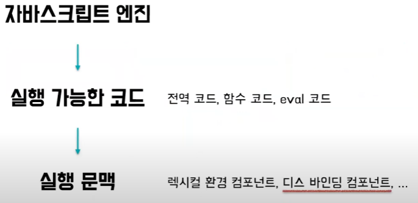
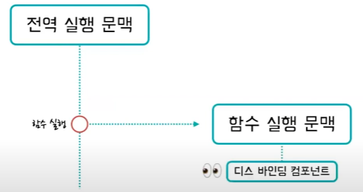
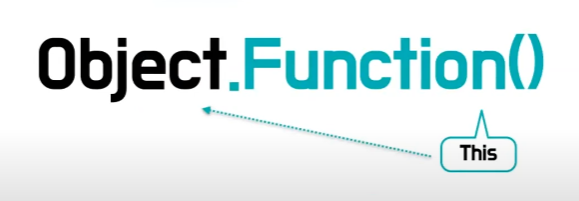

# This
This는 함수가 속해있는 자기 자신  
JS의 함수는 객체. 그 중에서도 일급 객체이다.

자바스크립트에서는 선언할때 결정되는 것이 있고 호출할 때 결정되는 것이 있다.   
this는 호출할때 결정 됨, this는 호출한 객체가 this가 된다.
this를 예외적으로 호출과 무관하게 묶어줄 수 있는, 고정시킬 수 있는 것은 bind라는 함수를 이용하서 묶어준다.

---

자바스크립트에서 모든 함수는 this를 가지고 있다.  
함수가 호출되면 그때 그때 상황에 따라 this가 가리키는 객체가 결정된다.  
함수가 호출될 때 마다 this가 동적으로 결정되는 것을 this가 그 객체에 "**바인딩**" 된다고 표현한다.

자바스크립트 엔진
  
자바스크립트 엔진은 실행 가능한 코드를 평가해서 실행문맥을 만든다.  

 
 함수가 실행이 되면 전역 코드 실행을 잠시 멈추고 함수 실행 문맥을 만든다. 이 타이밍에서 this 바인딩 컴포넌트의 값이 결정된다.

 
 일반적으로 this는 점 앞에 있는 객체, 즉 호출 당시 함수를 포함하고 있는 객체에 바인딩 된다. 
 함수가 객체에 의해 호출 되지 않는 상황(object가 없는 상황)에서 this가 어떻게 바인딩 될까?

 ## this의 바인딩 룰
 1. 기본 바인딩
 2. ㅇ

 # 화살표 함수의 this
